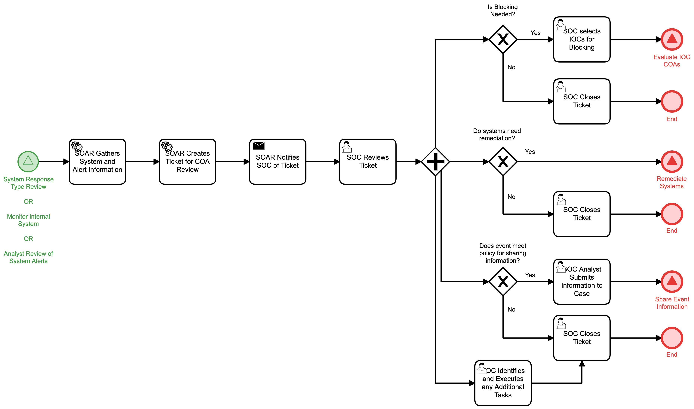

# System COA Alert Review Detail

## Description
This workflow processes details for a system that has been flagged for response due to an
internal alert. The workflow provides suggested COAs to the SOC operator via a ticket and 
process the response from the operator:

- If blocking of discovered IOCs are needed, the operator selects the IOCs and the 
"Evaluate IOC COAs" (Respond) workflow is triggered.
- If systems require remediation, the "Remediate Systems" (Respond) workflow is triggered.
- If information from the event meet policy for sharing, the analyst submits the 
information to the case and the "Share Event Information" (Identify) workflow is triggered.
- If any additional COAs are required, the SOC executes those COAs manually.

This workflow may be called from the following workflows:
- "System Response Type Review" (Detect)
- "Monitor Internal System" (Detect)
- "Analyst Review of System Alerts" (Detect)

## Workflow 

